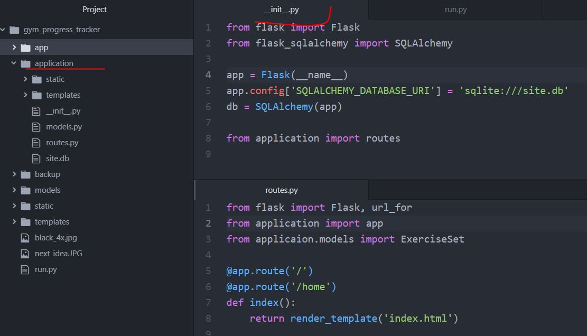

<h2>Flask Full Stack Application</h2>

<h3>Intro</h3>
<ul>
  <li>With SQLAlchemy we can represent database structure as classes called models.=</li>
  <li>Each class represents data schema, so it is a sinle table in a database.</li>
</ul>

<h3>Installation</h3>
<ul>
  <li>In terminal:
     
    - pip install flask 
    - pip install flask-sqlalchemy
  </li>
  <li>In main.py:
     
    > app = Flask(__name__) 
    > from flask_sqlalchemy import SQLAlchemy 
    > app.config['SQLALCHEMY_DATABASE_URI'] = 'sqlite:///site.db' # /// indicates relative path of a project - db will be created in main directory  
    > db = SQLAlchemy(app) 
  </li>
  <li>In Python interpreter (project directory):
     
    > from main import db 
    > db.create_all() 
    > from main import ExerciseSet 
    > set1 = ExerciseSet('Bench Press', 80, 6) 
    > set2 = ExerciseSet('Bench Press', 90, 5) 
    > set3 = ExerciseSet('Bench Press', 100, 3) 
    > db.session.add(set1) 
    > db.session.add(set2) 
    > db.session.add(set3) 
    > db.session.commit() 
    > ExerciseSet.query.all() 
    > ExerciseSet.query.first() 
    > ExerciseSet.query.filter_by(name='Bench Press').all() 
    > bench = ExerciseSet.query.filter_by(name='Bench Press').first() 
    > ex1 = ExerciseSet.query.get(1) 
    > bench.weight 
    > db.drop_all() # drops all db's tables
  </li>
</ul>

<h3>Package Structure</h3>
<ul>
  <li>Directory 'application' with __init__.py defined becomes python package.</li>
  <li>In __init__.py, I create app instance.</li>
  <li>I can import from it then: <b>from application import app</b> as if <b>from application.__init__.py import app</b>.</li>
  <li>Any other modules from 'application' package can be iumported according to: <b>from package.module import class</b> -> <b>from application.models import MyModel</b>.</li>
   
  
   
  <li>Project structre:</li>
  
</ul>
