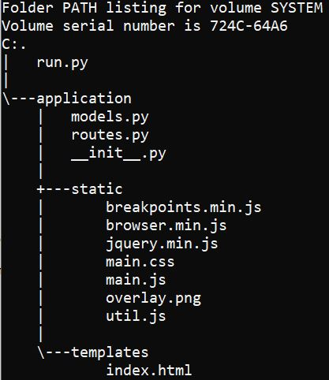

<h2>Flask Full Stack Application</h2>

<h3>Intro</h3>
<ul>
  <li>With SQLAlchemy we can represent database structure as classes called models.=</li>
  <li>Each class represents data schema, so it is a sinle table in a database.</li>
</ul>

<h3>Installation</h3>
<ul>
  <li>In terminal:
     
    - pip install flask 
    - pip install flask-sqlalchemy
  </li>
  <li>In main.py:
     
    > app = Flask(__name__) 
    > from flask_sqlalchemy import SQLAlchemy 
    > app.config['SQLALCHEMY_DATABASE_URI'] = 'sqlite:///site.db' # /// indicates relative path of a project - db will be created in main directory  
    > db = SQLAlchemy(app) 
  </li>
  <li>In Python interpreter (project directory):
     
    > from main import db 
    > db.create_all() 
    > from main import ExerciseSet 
    > set1 = ExerciseSet(name='Bench Press', weight=80, reps=6) 
    > set2 = ExerciseSet(name='Bench Press', weight=90, reps=5) 
    > set3 = ExerciseSet(name='Bench Press', weight=100, reps=3) 
    > db.session.add(set1) 
    > db.session.add(set2) 
    > db.session.add(set3) 
    > db.session.commit() 
    > ExerciseSet.query.all() 
    > ExerciseSet.query.first() 
    > ExerciseSet.query.filter_by(name='Bench Press').all() 
    > bench = ExerciseSet.query.filter_by(name='Bench Press').first() 
    > ex1 = ExerciseSet.query.get(1) 
    > bench.weight 
    > db.drop_all() # drops all db's tables
  </li>
  <li>Quering db with filters:
     
    > e = ExerciseSet.query.filter_by(name='B').all() 
    > e = ExerciseSet.query.filter_by(name='B').all()[-1] # getting last item 
  </li>
</ul>

<h3>Package Structure</h3>
<ul>
  <li>Directory 'application' with __init__.py defined becomes python package.</li>
  <li>In __init__.py, I create app instance.</li>
  <li>I can import from it then: <b>from application import app</b> as if <b>from application.__init__.py import app</b>.</li>
  <li>Any other modules from 'application' package can be iumported according to: <b>from package.module import class</b> -> <b>from application.models import MyModel</b>.</li>
   
  
   
   
  <li>Project structre:</li>
   
  
   
   
  <li>Running Flask server with <b>python run.py</b></li>
</ul>

<h3>SQLALchemy</h3>
<ul>
  <li>Creating model instance = table row, we need to provide <b>keyword arguments</b>:</li>
   
  
   
   
  <li>filter_by with multiple criterias:
     
    - set.query.filter_by(week=1, name="Squat").first().w
  </li>
  <li>Taking last item:
     
    - set.query.filter_by(name='Bench Press').all()[-1].w
  </li>
</ul>

<h3>Forms</h3>
<ul>
  <li>Library installation: pip install flask-wtf.</li>
  <li>Python import: from flask_wtf import FlaskForm.</li>
  <li>Python classes are representative of forms. They will be automatically converted into HTML forms within a template.</li>
  <li>Form fileds are imported from wtforms:
     
    - from wtforms import StringField 
    - username = StringField()
  </li>
  <li>Validators for validation are imported from wtforms.validators:
     
    - from wtforms.validators import DataRequired, Length 
    - username = StringField('Username', validators=[DataRequired(), Length(min=2,max=20)]) 
    - first argument is the html label
  </li>
  <li>Submit button:
     
    - from wtforms import SubmitField 
    - submit = SubmitField('Submit')
  </li>
  <li>Bolean field:
     
    - from wtforms import BooleanField 
    - remember = BooleanField('Remember Me')
  </li>
  <li>Dropdown field:
     
    - from wtforms import SelectField
    - name = SelectField('Exercise Name', choices=['Bench Press','Deadlift','Squat'])
  </li>
  <li>Importing form into routes
     
    
  </li>
</ul>
